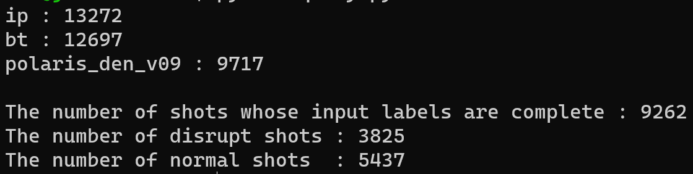

# How to use MetaDB  
## **MetaDB**
  Get meta or query eligible information from MetaDB.
  ```python
    from jddb import meta_db
    connection_str = {
              "host" : "localhost",
              "port" : 27017,
              "username" : "DDBUser",
              "password" : "*******",
              "database": "JDDB"
            }
    collection = "Labels"
    db = meta_db.MetaDB(connection_str, collection)                  
  ```
- ### **db.connect(connection_str, collection)**
    **Description:**  
      Connect to MetaDB befor any other action.  

    **Parameters:**  
      connection_string : Dictionary. The connections string to a mongodb server. Such as "host", "port", "username", "password" and so on.  
      collection : String. Collection name for the MetaDB.  
    **Return:**  
      Collection of the MetaDB
    
- ### **db.disconnect()**
    **Description:**  
      Disconnect from MetaDB after any other action.

  ### **Example :**
      ```python
        # Connect to the MetaDB
        from jddb import meta_db
        connection_str = {
                  "host" : "localhost",
                  "port" : 27017,
                  "username" : "DDBUser",
                  "password" : "*******",
                  "database": "JDDB"
                }
        collection = "Labels"
        db = meta_db.MetaDB()
        labels = db.connect(connection_str,collection)

        # Disconnect from MetaDB
        db.disconnect()
        ```
- ### **db.get_labels(shot_no)**  
  **Description:** 
    Get all meta of the shot inputed  
  **Parameters:**  
    shot_no : int or string. The shot number whose meta you want to get.  
  **Return:**  
    Dictionary. The meta you want.

  ### **Example :**
    ```python
    db.get_labels(1066648)

    -Return:
    {'shot': 1066648, 'ip': True, 'IsDisrupt': False, 'DownTime': 0.5923408076837159, 'bt': True, ... 'MA_TOR1_R09': True}
    ```
- ### **db.updata_labels(shot_no, labels)**
  **Description:**  
    Update or modify the meta of a shot in MetaDB.  
  **Parameters:**  
    shot_no : int or string. The shot number whose meta you want to update or modify.  
    labels : Dictionary. The meta contents you want to update or modify. 

  ### **Example :**
    ```python
    new_meta = {'ip': True, 'IsDisrupt': False, 'DownTime': 0.59234, ...}
    db.updata_labels(1066648, new_meta)
    ```

- ### **db.query(shot_list=None, filter=None)**
  **Description:**   
    Query the shots that meet the set conditions within the set shot number range.  
  **Parameters:**  
    shot_list : List. The range of shot numbers queried. If shot_list=None, query all shots in the MetaDB.  
    filter : Dictionary. The filter condition for the query. The description format of the condition must comply with Mongodb's specifications, and specific details can be found on the official website of Mongodb. If filter=None, Return all shot number in MetaDB.  
  **Return:**  
    List. Shot number that meets the filter condition.  
  ### **Example :**
    ```python
    my_query = {'IsDisrupt': True, 'IpFlat':{'$gt':50}}
    db.query(my_query)

    -Return:
    [1046770, 1046794, 1046795, 1046806, 1046800 1046858, . . . , 1049184, 1050467, 1052286, 1050560, 1052295]
    ```


- ### **db.query_valid(shot_list=None, label_true=None, label_false=None)**
  **Description:**  
    For labels whose information stored in the database is True or False, return shot number that meets the filter condition.  
  **Parameters:**  
    shot_list : List. The range of shot numbers queried. If shot_list=None, query all shots in the MetaDB.  
    label_true : List of label names. Filter condition. The returned shots must satisfy that all labels in the label_true are True.  
    label_false : List of label names. Filter condition. The returned shots must satisfy that all labels in the label_false are False.  
  **Return:**  
    List. Shot number that meets the filter condition.
  ### **Example :**  
    Get non-disruption shots with [" ip", " bt"] diagnostics available in the shot number range of [1064000, 1066649]
    ```python
    shot_list = [shot for shot in range(1064000, 1066649+1)]
    db.query_valid(shot_list=shot_list, label_true=[r"ip", r"bt"], label_false=[r"IsDisrupt"])

    -Return:
    [1064000, 1064001, 1064002, 1064003, 1064004,  .... 1066642, 1066643, 1066644, 1066646, 1066648]
    ```

- ### **db.query_range(label_list, lower_limit=None, upper_limit=None, shot_list=None)**  
  **Description:**   
    For labels with numeric values stored in the database, return shot number that meets the filter condition.   
  **Parameters:**  
    label_list : A list of labels that store information as numeric values.   
    lower_limit : List of lower limit values. ">=". If there is only an upper limit and no lower limit in the filter condition, the lower limit value in the corresponding position in the lower limit list is set to None.   
    upper_limit : List of upper limit values. "<=". If there is only an lower limit and no upper limit in the filter condition, the upper limit value in the corresponding position in the upper limit list is set to None.    
    shot_list : List. The range of shot numbers queried. If shot_list=None, query all shots in the MetaDB.    
  **Return:**  
    List. Shot number that meets the filter condition.
  ### **Example :**  
    Get shots with DownTime in [0.2, 0.8]s and average flat-top value of IP in [150, inf]KA within the shot number range of [1064000, 1066648].
    ```python
    shot_list = [shot for shot in range(1064000, 10666489)]
    db.query_range(["DownTime","IpFlat"], lower_limit=[0.2,150], upper_limit=[0.8, None], shot_list=shot_list)

    -Return:
    [1064000, 1064001, 1064002, 1064003, 1064004,  .... 1066642, 1066643, 1066644, 1066646, 1066648]
    ```

- ### **db.count_label(shot_list, label_list, need_nd=False, show=True)**
  **Description:**   
    Count and display the number of shots available in the given shot number list for each given diagnosis; Finally, count and display the number of shots available for all given diagnostic signals in the given shot number list, as well as the number of non-disruption and disruption shots. Returns the list of available shots for diagnosis.  
  **Parameters:**  
    shot_list : List. The queried range of shot numbers.  
    label_list : List. The queried label names.  
    need_nd : Bool. The default value is False, and only the list of shots available for all diagnostics is returned; When need_nd=True, the list of shots available for all diagnostics, as well as a list of non-disruption shots and a list of disruption shots are returned.  
    show : Bool. The default is True, which displays the number of shots available for each given diagnostic in the given shot number list, the number of shots available for all given diagnostic signals, and the number of non-disruption and disruption shots. If show=False, don't displayed.    
  **Return:**  
    When need_nd=False, only return one list, which is the list of shots available for all given diagnostic signals.  
    When need_nd=True, return three lists, which are the list of shots available for all given diagnostic signals, list of non-disruption shots, and list of disruption shots.
  ### **Example :**  
    ```python
    shot_list = [shot for shot in range(1064000, 10666489)]
    labels = ["ip", "bt", "polaris_den_v09"]
    db.count_label(shot_list, labels)
    ```
    Show:
      
    Returns a list of shots available for all given diagnosis, a list of non-disruption shots, and a list of disruption shots.  
    ```python
    CompleteShots, NormalShots, DisruptShots = db.count_label(shot_list, labels, need_nd=True, show=False)
    ```